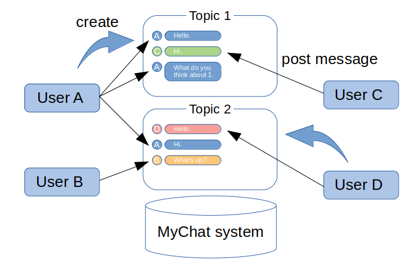

# Requirements Definition

## Overviews

  In recent years, the opportunities of the communications with others have become lesser because of the COVID-19 pandemic.
The lonely need to chat with anyone. 
MyChat aims to provide the real-time online communications with them.
In this application, the users chat with anyone anonymously in the chatting room with themes. 
They can make, enter and leave it freely.
In addition, they can begin to use this application easily.

### 1. Schematic

### 2. Business flow

### 3. Use case

## Business requirements

## Functional requirements

## Non-functional requirements
